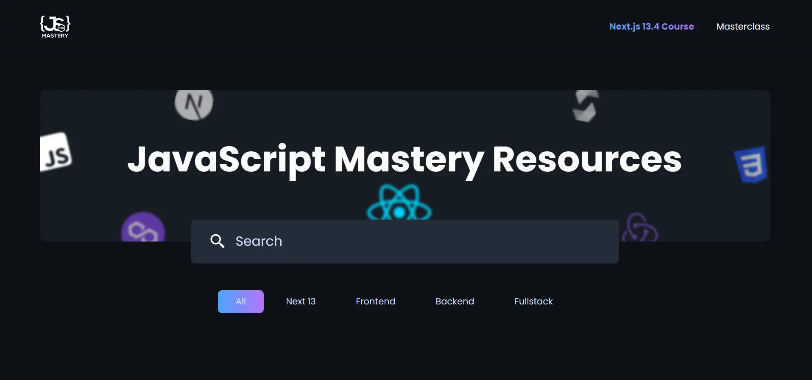

<div align="center">
    <a href="https://nextjs-filter-fv.netlify.app" target="_blank">
      
    </a>
  <h3 align="center">Optimized Next.js Search/Filter</h3>
</div>

##  <br /> 📋 <a name="table">Table of Contents</a>

- ✨ [Introduction](#introduction)
- ⚙️ [Tech Stack](#tech-stack)
- 📝 [Features](#features)
- 🚀 [Quick Start](#quick-start)

##  <br /> <a name="introduction">✨ Introduction</a>

**[EN]** This project is a Next.js optimization test with a search and filter feature, designed to create a performant and responsive web application that allows users to efficiently search and filter through a dataset. The primary goal is to evaluate and showcase the optimization capabilities of Next.js, focusing on server-side rendering, static site generation, and client-side performance enhancements. 

**[FR]** Ce projet est un test d'optimisation Next.js avec une fonctionnalité de recherche et de filtrage, conçu pour créer une application web performante et réactive permettant aux utilisateurs de rechercher et de filtrer efficacement un ensemble de données. L'objectif principal est d'évaluer et de démontrer les capacités d'optimisation de Next.js, en se concentrant sur le rendu côté serveur, la génération de sites statiques et les améliorations de performance côté client.

##  <br /> <a name="tech-stack">⚙️ Tech Stack</a>

- **React** is a popular JavaScript library for building user interfaces, particularly single-page applications where data changes over time. React's component-based architecture allows developers to create reusable UI components, making development more efficient and the codebase easier to maintain. 

- **Next.js** is a React framework known for its server-side rendering (SSR) and static site generation (SSG) capabilities, enhancing performance and SEO for web applications. It offers features like automatic code splitting, API routes for server-side logic, and a plugin system for extensibility.

- **TypeScript** is a statically typed superset of JavaScript that allows for early detection of errors and more robust, maintainable code. TypeScript's type system helps developers catch mistakes early during the development process, ensuring a more stable and reliable application.

- **Sanity.io** is a headless CMS that offers real-time collaborative editing, structured content, and a highly customizable platform. It allows developers to build scalable, content-driven applications by providing a flexible and robust backend for managing and delivering content.

- **Node.js** is a JavaScript runtime built on Chrome's V8 engine that enables server-side scripting. It allows developers to build scalable network applications using JavaScript, leveraging its non-blocking, event-driven architecture for high performance.

- **clsx** is a tiny utility for constructing className strings conditionally. It simplifies the process of dynamically assigning multiple class names based on various conditions, helping developers manage CSS class names efficiently.

- **Query-string** is a library for parsing and stringifying URL query strings. It provides a simple and efficient way to handle URL parameters, making it easier for developers to manage and manipulate query strings in web applications.

- **Tailwind** is a utility-first CSS framework that speeds up UI development by providing a set of pre-built utility classes. It allows developers to quickly build custom designs without writing traditional CSS, promoting rapid prototyping and design consistency.

- **Tailwind-merge** is a utility that intelligently merges Tailwind CSS class names. It helps resolve conflicts and ensures that the final set of class names applied to an element is valid and effective, improving the management of Tailwind CSS classes in complex scenarios.

## <br /> <a name="quick-start">🚀 Quick Start</a>

Follow these steps to set up the project locally on your machine.

<br/>**Prerequisites**

Make sure you have the following installed on your machine:

- [Git](https://git-scm.com/)
- [Node.js](https://nodejs.org/en)
- [npm](https://www.npmjs.com/) (Node Package Manager)

<br/>**Cloning the Repository**

```bash
git clone {git remote URL}
```

<br/>**Installation**

Let's install the project dependencies, from your terminal, run:

```bash
npm install
# or
yarn install
```

<br/>**Set Up Environment Variables**

Create a new file named `.env` in the root of your project and add the following content:

```env
NEXT_PUBLIC_SANITY_PROJECT_ID=""
NEXT_PUBLIC_SANITY_DATASET=""
NEXT_PUBLIC_SANITY_TOKEN=""
```

Replace the placeholder values with your actual respective account credentials:

- [Sanity](https://www.sanity.io)


<br/>**Running the Project**

Installation will take a minute or two, but once that's done, you should be able to run the following command:

```bash
npm run dev
# or
yarn dev
```

Open [`http://localhost:3000`](http://localhost:3000) in your browser to view the project.